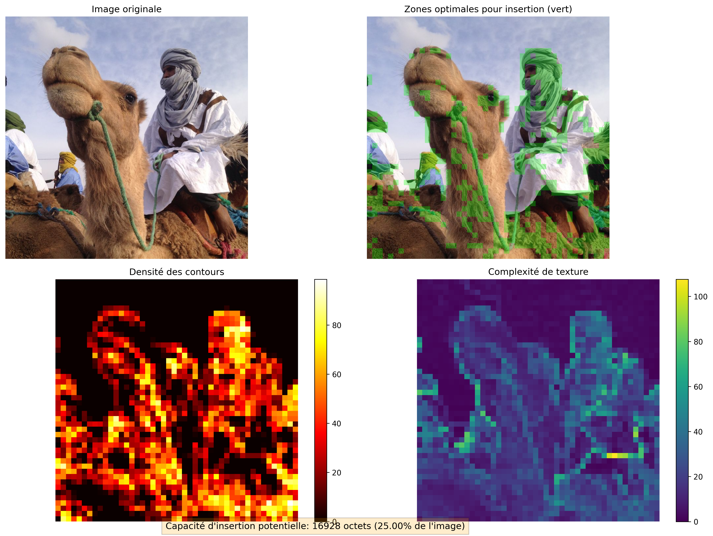
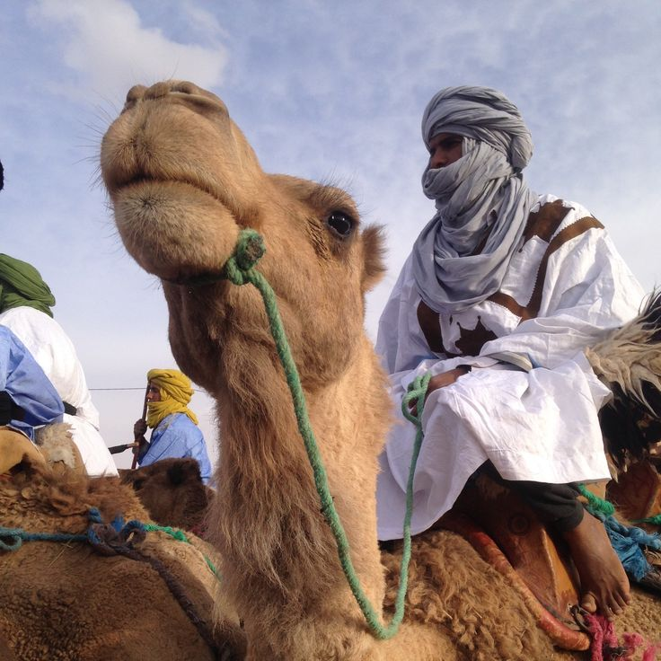

# 🧠 StegaMind

<p align="center">
  
  <br>
  <em>Stéganographie intelligente avec analyse optimisée</em>
</p>

StegaMind est un outil de stéganographie intelligent qui utilise l'analyse d'image pour cacher des données secrètes dans les zones optimales d'une image de manière imperceptible.

## 🔍 Qu'est-ce que la stéganographie?

La stéganographie est l'art de cacher des informations dans un support de manière à ce que seuls l'expéditeur et le destinataire soient conscients de la présence de ces informations. Contrairement au chiffrement qui rend les données illisibles mais visibles, la stéganographie dissimule complètement l'existence même de la communication secrète.

## ✨ Caractéristiques de StegaMind

- 🧠 **Analyse intelligente des images** : Identifie automatiquement les zones les plus adaptées pour cacher des données
- 🎯 **Insertion ciblée** : Insère les données uniquement dans les zones où les modifications seront indétectables
- 📦 **Support multi-format** : Cache du texte ou des fichiers entiers dans les images
- 🔥 **Visualisation des zones optimales** : Génère des cartes de chaleur pour visualiser les zones les plus appropriées
- 💾 **Haute capacité** : Utilise les 3 canaux de couleur (RGB) pour maximiser la quantité de données cachées

## 🏗️ Architecture du projet

Le projet est divisé en deux modules principaux :

1. 📊 **Module d'analyse d'image** (`image_analyzer.py`) :
   - Calcule la densité des contours dans l'image
   - Évalue la complexité de texture de l'image
   - Identifie les zones optimales pour la stéganographie
   - Génère des visualisations et des analyses de capacité

2. 🔐 **Module de stéganographie** (`steganography.py`) :
   - Insère des données secrètes (texte ou fichiers) dans les zones optimales
   - Utilise la technique LSB (Least Significant Bit)
   - Effectue des vérifications de capacité
   - Enregistre l'image contenant les données cachées

## 🚀 Installation et prérequis

```bash
# Cloner le dépôt
git clone https://github.com/HamzaBraik01/StegaMind.git
cd StegaMind

# Installer les dépendances
pip install numpy opencv-python matplotlib
```

## 📝 Comment utiliser StegaMind

### 1️⃣ Analyse d'une image

```python
from image_analyzer import ImageAnalyzer

# Initialiser l'analyseur avec une image
analyzer = ImageAnalyzer("chemin_vers_image.jpg")

# Visualiser les zones optimales et obtenir la capacité estimée
highlighted_image, mask, capacity = analyzer.visualize_analysis(
    block_size=16,      # Taille des blocs d'analyse (plus grand = analyse plus grossière)
    threshold_percentile=75  # Seuil pour déterminer les zones optimales (plus élevé = zones plus sélectives)
)

print(f"Capacité d'insertion LSB estimée: {capacity} octets")
```

### 2️⃣ Cacher du texte dans une image

```python
from steganography import SteganographyEncoder

# Initialiser l'encodeur
encoder = SteganographyEncoder("chemin_vers_image.jpg")

# Afficher la capacité d'insertion disponible
print(f"Capacité d'insertion: {encoder.capacity} octets")

# Cacher un message texte
message_secret = "Voici un message secret à cacher dans l'image."
output_path = encoder.encode_text(message_secret)

print(f"Message caché avec succès dans: {output_path}")
```

### 3️⃣ Cacher un fichier dans une image

```python
from steganography import SteganographyEncoder

# Initialiser l'encodeur
encoder = SteganographyEncoder("chemin_vers_image.jpg")

# Cacher un fichier
output_path = encoder.encode_file("document_secret.pdf")

print(f"Fichier caché avec succès dans: {output_path}")
```

## ⚙️ Comment fonctionne StegaMind?

### 🔍 1. Analyse d'image

StegaMind utilise deux métriques principales pour identifier les zones optimales :

- 📊 **Densité des contours** : Les zones avec beaucoup de contours sont généralement plus complexes visuellement et peuvent mieux masquer les modifications.
- 🔢 **Complexité de texture** : Les régions à haute variance de couleur ou luminosité sont idéales pour cacher des données car les petites modifications y sont moins perceptibles.

Ces deux métriques sont combinées pour créer une carte des zones optimales de l'image.

### 🔐 2. Technique d'insertion LSB

La méthode LSB (Least Significant Bit) consiste à remplacer le bit le moins significatif des valeurs RGB des pixels par les bits des données à cacher. Cette modification est imperceptible à l'œil nu, surtout dans les zones complexes de l'image.

StegaMind améliore cette technique en ciblant uniquement les zones optimales identifiées lors de l'analyse, ce qui augmente la sécurité et l'imperceptibilité des données cachées.

## 📷 Exemples de résultats

<p align="center">
  
  <br>
  <em>Analyse des zones optimales pour la stéganographie</em>
</p>

<div style="display: flex; justify-content: center;">
  <div style="margin: 10px; text-align: center;">
    
    <p><em>Image originale</em></p>
  </div>
  <div style="margin: 10px; text-align: center;">
    
    <p><em>Image avec données cachées</em></p>
  </div>
</div>

Cette visualisation montre :
- 🖼️ L'image originale
- 🟢 Les zones optimales identifiées (en vert)
- 🔥 La carte de densité des contours
- 🌈 La carte de complexité de texture

## ⚠️ Limitations

- 🔄 Les modifications de l'image après l'insertion (redimensionnement, compression, etc.) peuvent détruire les données cachées
- 📊 La capacité d'insertion dépend de la complexité de l'image
- 🔒 La stéganographie est une technique de sécurité par l'obscurité et ne remplace pas le chiffrement

## 🔮 Développements futurs

- 📤 Implémentation d'un module de décodage pour extraire les données cachées
- 🎨 Support de formats d'image supplémentaires (GIF, WebP, etc.)
- 🔐 Intégration de techniques de chiffrement pour sécuriser davantage les données
- 🖥️ Interface graphique pour faciliter l'utilisation
- 🛡️ Résistance aux attaques stéganalytiques

